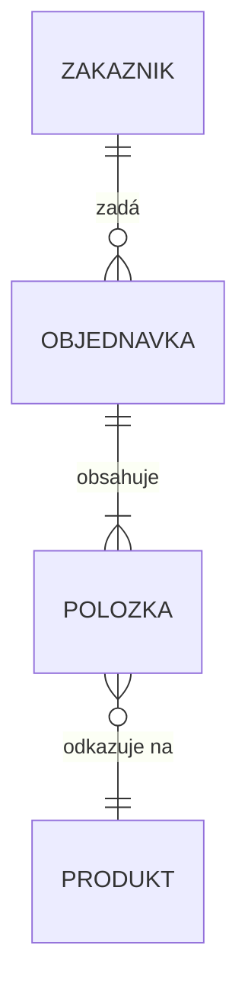

# Pojmy relačních databází a jejich návrh

---

## Relační databáze

Data jsou uložena v **tabulkách** (relacích) — každá tabulka má řádky (záznamy) a sloupce (atributy).

**Databáze** = strukturovaný soubor dat sloužící k uchování, třídění a modifikaci dat.

**DBS** (Databázový systém) = databáze + **DBMS** (software pro správu — definuje, dotazuje, modifikuje data).

Příklady DBMS: MS SQL Server, MySQL, PostgreSQL, MariaDB, SQLite, Oracle.

> DB = soubor/soubory s daty na disku. DBMS = software, který je spravuje (čte, zapisuje, odpovídá na dotazy).

---

## Klíče

| Klíč | Popis |
|---|---|
| **Primární klíč (PK)** | jednoznačně identifikuje záznam; musí být vyplněn; většinou umělý; může se skládat z více atributů |
| **Cizí klíč (FK)** | atribut obsahující PK jiného záznamu — zajišťuje vazbu mezi tabulkami |
| **Kandidátní klíč** | atribut, který by mohl být primárním klíčem (splňuje jedinečnost), ale nebyl zvolen jako PK |

---

## Validační pravidla (integritní omezení)

Pravidla, která zajišťují správnost a konzistenci dat:

| Omezení | Popis |
|---|---|
| `NOT NULL` | hodnota nesmí být prázdná |
| `UNIQUE` | hodnota musí být jedinečná v celém sloupci |
| `CHECK` | hodnota musí splňovat podmínku (`CHECK (vek >= 0)`) |
| `DEFAULT` | výchozí hodnota, pokud není zadána |
| `FOREIGN KEY` | FK musí odkazovat na existující PK — viz referenční integrita |

**Referenční integrita** — pravidlo, které zaručuje, že hodnota cizího klíče vždy odpovídá existujícímu záznamu v odkazované tabulce. Databáze ji porušuje například když objednávka odkazuje na zákazníka s ID 4, ale takový zákazník neexistuje.

---

## Postup návrhu databáze

Návrh se dělí do tří kroků:

### 1. Koncepční model
- účel databáze — k čemu se bude používat, kdo k ní přistupuje
- požadavky na přístup a uchovávaná data
- identifikace prvků: **entity, atributy, vazby**
- výsledek: základní ER diagram (bez klíčů a datových typů)

### 2. Logický model
- určení vztahů mezi entitami (1:1, 1:N, M:N)
- rozdělení do tabulek, přiřazení primárních klíčů
- odstranění nedostatků (**redundance, nekonzistence**)
- aplikace normalizačních pravidel
- výsledek: detailní ER diagram s klíči a vazbami

### 3. Fyzický model
- návrh pro konkrétní databázový systém (MS SQL, MariaDB, Oracle…)
- definice datových typů, integritních omezení, zabezpečení
- výsledek: SQL skripty pro vytvoření tabulek

---

## Nedostatky v návrhu

- **Redundance** — opakovaný výskyt stejných dat (vedoucí oddělení zapsaný u každého pracovníka)
- **Nekonzistence** — při opravě je nutné změnit data na více místech → riziko chyb

Řešení: rozdělit do více tabulek a propojit přes cizí klíč:

```
Špatně:                         Správně:
oddělení | vedoucí | pracovník  Oddělení: ID | Název | Vedoucí(FK)
Projekce   Růžička   Karas      Pracovník: ID | Jméno | Oddělení(FK)
Projekce   Růžička   Kos
```

Úspora místa: 100 000 záznamů × 50 znaků = **4,77 MB** vs. jedna hodnota + 100 000 odkazů = **97,7 kB**

---

## Normalizační pravidla

Slouží k odstranění redundancí, zvýšení efektivity a předejití nekonzistenci. V praxi se používají 3 normální formy — každá vyšší zahrnuje tu předchozí.

> normálové formy
### 1. NF — atomické hodnoty
- žádné opakující se skupiny sloupců (Zboží1, Zboží2, Zboží3…)
- každá hodnota je **atomická** (dále nedělitelná)
- existuje primární klíč

```
Špatně: Adresa = "Školní 101, Trutnov 541 01"  (celý řetězec)
Správně: Ulice | Čp. | Město | PSČ             (atomické sloupce)
```

### 2. NF — závislost na celém klíči
- splněna 1. NF
- každý atribut, který není PK, musí být **závislý na celém primárním klíči** (ne jen na jeho části)
- odstranění duplicitních záznamů

```
Špatně: ID_faktury | Datum | ID_zboží | Kusů | Cena
  → Datum závisí jen na ID_faktury, ne na ID_zboží
Správně: rozdělit na tabulku Faktury a tabulku PolozkyFaktury
```

### 3. NF — každý atribut závisí přímo na klíči
- splněna 2. NF
- žádný atribut nesmí záviset na jiném neklíčovém atributu — pouze na PK
- odvozené atributy se neukládají (dají se dopočítat)

```
Špatně: ID | Příjmení | Platová třída | Základní plat
  → Základní plat závisí na Platové třídě, ne na ID pracovníka
Správně: Pracovník(ID, Příjmení, Platová třída) + PlatováTřída(ID, Základní plat)

Špatně: ID | Název | Ks | Cena | Celkem
  → Celkem = Ks × Cena → odvozený atribut, stačí dopočítat
Správně: Celkem sloupec odstranit
```

---

## ER diagram

Grafické znázornění struktury databáze.

**Značky (Chen notace):**
```
[Entita]       — obdélník
(Atribut)      — elipsa
<Vztah>        — diamant
——————         — spojnice (1, N, M)
```

**Crow's Foot notace** — značky se píší na obě strany spojnice (`levá--pravá`):

- `||` — právě jeden
- `o|` — nula nebo jeden
- `|{` — jeden nebo více
- `o{` — nula nebo více

**Příklad v Mermaidu:**


Čtení: `ZAKAZNIK ||--o{ OBJEDNAVKA` = zákazník má právě jeden účet, ale objednávek může mít nula nebo více.

**Vazby:**
- **1:1** — jeden záznam odpovídá právě jednomu (člověk – pas)
- **1:N** — jeden odpovídá více (oddělení – zaměstnanci)
- **M:N** — více odpovídá více → řeší se vazební tabulkou (studenti – předměty)

---

## Datové typy

| Skupina | Typy | Příklady použití |
|---|---|---|
| **Číselné** | `INT`, `BIGINT`, `DECIMAL`, `FLOAT` | věk, cena, množství |
| **Znakové** | `CHAR(n)`, `VARCHAR(n)`, `TEXT` | jméno, e-mail, popis |
| **Datové/časové** | `DATE`, `TIME`, `DATETIME`, `TIMESTAMP` | datum narození, čas objednávky |
| **Logické** | `BIT`, `BOOLEAN` | aktivní/neaktivní |
