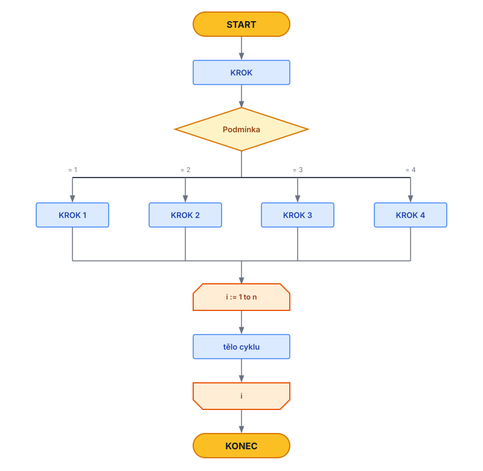

# Algoritmizace

**Algoritmizace** = proces návrhu a tvorby algoritmu — postup, jak ze zadaného problému sestavit přesný návod k jeho řešení.

---

# Algoritmus

**Definice:** Přesný a konečný návod či postup, jak krok za krokem vyřešit určitý problém nebo úkol.

---

## Základní vlastnosti

Pro každý správn ě sestavený algoritmus platí tyto klíčové vlastnosti:

* **Konečnost (Finitnost):** Algoritmus musí skončit po konečném množství kroků.
* **Jednoznačnost (Determinovanost):** Každý krok musí být jasně definovaný. Pořadí operací je kritické (např. při otevírání dveří musíme nejdříve odemknout, až pak táhnout).
* **Obecnost (Hromadnost):** Algoritmus by neměl řešit jen jeden konkrétní případ (např. 2+3), ale celou třídu podobných úloh (např. sčítání jakýchkoliv dvou čísel).
* **Vstup:** Algoritmus přijímá 0 nebo více vstupních dat.
* **Výstup:** Algoritmus musí mít alespoň jeden výstup (výsledek).

---

## Způsoby zápisu algoritmů

Zápis se pohybuje na spektru od lidské řeči až po kód srozumitelný stroji.

### 1. Slovní zápis
* Běžný přirozený jazyk.
* **Nevýhoda:** Často nejednoznačný a příliš upovídaný.

### 2. Vývojové diagramy
* Grafické znázornění pomocí standardizovaných symbolů (obdélníky, kosočtverce atd.).
* Ideální pro vizualizaci logiky a větvení.



### 3. Pseudokód
Čitelný text připomínající kód, u kterého nás netrápí syntaxe konkrétního jazyka. Je nezávislý na platformě.

**Příklad:**
```text
NASTAV pravdivost NA Pravda

FUNKCE Vyhodnoceni(hodnota)
    POKUD je hodnota Pravda PAK
        VYPIŠ "pravda"
    JINAK
        VYPIŠ "lež"
    KONEC POKUD
KONEC FUNKCE

ZAVOLEJ FUNKCI Vyhodnoceni S ARGUMENTEM pravdivost

```
## 4. Programovací jazyk

Jednoznačný zápis v konkrétním jazyce (např. JavaScript, Python, C++).

**Příklad (JavaScript):**

JavaScript

```
const pravdivost = true;

function vyhodnoceni(hodnota) {
    if (hodnota) {
        console.log("pravda");
    } else {
        console.log("lež");
    }
}

vyhodnoceni(pravdivost);
```

---

## Dekompozice

Proces rozdělení složitého algoritmu na menší, lépe zvládnutelné a přehlednější části.

**Hlavní výhody:**

- Snažší hledání a oprava chyb.
    
- **Znovupoužitelnost:** Jednou napsanou část (funkci) můžeme použít vícekrát.
    
- Lepší čitelnost pro ostatní vývojáře.
    

---

## Prostorová a časová složitost

Popisuje efektivitu algoritmu pomocí **Big O notace**.

> **Důležité:** Časovou složitost neměříme v sekundách, ale v **počtu operací**, aby výsledek nezávisel na výkonu konkrétního hardwaru.

## Časová složitost T(n)

Udává, kolik elementárních operací (sčítání, porovnání, přiřazení) algoritmus provede v závislosti na velikosti vstupu (n).

|**Notace**|**Název**|**Příklad / Popis**|
|---|---|---|
|**O(1)**|Konstantní|Čas je stálý (např. přístup k prvku pole přes index).|
|**O(log n)**|Logaritmická|V každém kroku zahodí polovinu dat (např. binární vyhledávání).|
|**O(n)**|Lineární|Složitost roste úměrně s daty (např. průchod neseřazeným seznamem).|
|**O(n log n)**|Kvazilineární|Typické pro efektivní řadicí algoritmy (Merge sort, Quick sort).|
|**O(n²)**|Kvadratická|Pro každou položku procházíme všechny ostatní (např. hledání duplicit v seznamu).|
|**O(2ⁿ)**|Exponenciální|Počet operací se zdvojnásobí s každým dalším prvkem.|

## Prostorová složitost S(n)

Udává, kolik paměti algoritmus spotřebuje během svého běhu. V dnešní době se často obětuje více paměti (prostorová složitost) výměnou za vyšší rychlost (časová složitost).
- do toho se počítá i velikost vstupu
